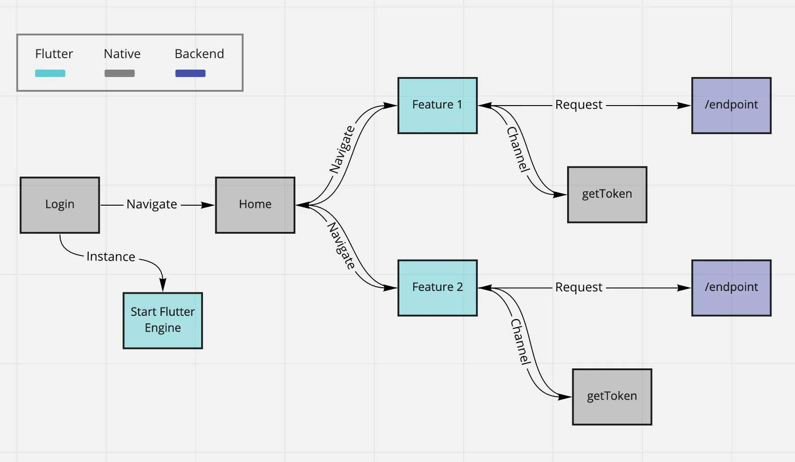

No fim de 2019, estive em uma saga para garantir que a integração entre um módulo Flutter e um aplicativo Android funcionasse com uma experiência idêntica entre ambos, enviando informações de um lado para o outro e com uma boa performance em geral.

Isso foi mais complicado do que eu imaginei, mas no fim tudo deu muito certo, e resolvi trazer minha jornada com alguns dos detalhes que eu descobri.

## Onde entra a complexidade?

Existem algumas coisas que podem atrapalhar bastante a experiência de desenvolver um módulo Flutter para o seu aplicativo, as duas principais são:

### Pacotes antigos

A presença de pacotes no seu módulo que utilizam alguma funcionalidade nativa, como por exemplo o acesso à lista de contatos do aparelho ou compartilhamento de arquivos, pode ser uma dor de cabeça caso eles não utilizem as novas [Android plugin APIS](https://flutter.dev/docs/development/packages-and-plugins/plugin-api-migration).

Algumas vezes esses pacotes vão te gerar um Warning dizendo que foram feitos para a utilização em um ambiente 100% Flutter (e não em um módulo), nesse caso, não será o fim do mundo, porém é recomendado que você substitua por outro pacote que execute a mesma função, evitando assim comportamentos inesperados.

### Autenticação compartilhada

Para aplicativos com login, você pode criar uma comunicação entre as plataformas, mas se você deixar a FlutterEngine pré cacheada e o módulo Flutter precisar de um token de acesso logo quando iniciar, ele vai solicitar esse token ao nativo através dessa comunicação, antes mesmo do usuário ter feito a autenticação. Por conta desses detalhes é importante entender como funciona a engine, e decidir quando instanciá-la.

---

Alguns desses problemas não vão aparecer em pequenos projetos, porém é importante ter em mente que comportamentos como esses podem acontecer quando você decide implementar uma plataforma nova.

## Alguns termos importantes
- **Flutter Engine**: É o motor que vai rodar o Dart Entrypoint que você definiu no seu projeto Flutter, presente no pacote disponibilizado para integração e também em projetos 100% Flutter.
- **Cached Engine**: Uma instância cacheada da Flutter Engine, criada para melhorar a performance na navegação à alguma funcionalidade do módulo.
- **Dart Entrypoint**: É o ponto inicializador do código Dart que será executado no módulo, pode ser uma rota específica ou um código que executa em background.
- **Binary Messenger**: Uma interface que facilita a comunicação entre o módulo e o APP raiz, através do envio de mensagens binárias de maneira assíncrona.
- **Flutter Activity**: Uma versão das Activities do android, porém com algumas modificações para executar e navegar para uma tela em Flutter através de uma instância da Flutter Engine.
- **Method Channel**: Um método que permite nomear um canal de comunicação entre o nativo e o módulo Flutter, permitindo que funções possam ser invocadas entre eles.

## Utilização de um módulo Flutter

Diferente de um [package](https://flutter.dev/docs/development/packages-and-plugins/developing-packages), o módulo Flutter é um código Dart direcionado especificamente para rodar integrado em códigos nativos, e não para prover uma funcionalidade a outro aplicativo Flutter. O Dart Entrypoint dele pode ou não conter elementos visuais (como uma lógica que roda em background ou uma tela diferente do aplicativo).

A criação de um novo módulo é feita através do comando:

```shell
flutter create -t module --org com.example my_flutter
```

Para fazer o setup inicial do módulo, a maneira mais simples é instalar o [`Flutter Plugin`](https://plugins.jetbrains.com/plugin/9212-flutter) no Android Studio, seguir as opções **File > New > New Module** e selecionar a ação de importar o módulo criado, ou então criar um novo, isso já vai instalar todos os pacotes necessários para rodar o módulo no seu projeto.

Também é possível realizar esse processo manualmente, todos os detalhes para configurar o módulo como dependência de uma aplicação Android podem ser encontrados na [documentação oficial](https://flutter.dev/docs/development/add-to-app/android/project-setup).

## Integrado, porém pouco escalável

Ter o módulo como dependência é a parte mais simples, e também a primeira coisa a se fazer. Conforme vamos seguindo os passos descritos na documentação, vamos incluir uma `Activity` para o Flutter no `AndroidManifest`:

```xml
<activity
  android:name="io.flutter.embedding.android.FlutterActivity"
  android:theme="@style/LaunchTheme"
  android:configChanges="orientation|keyboardHidden|keyboard|screenSize|locale|layoutDirection|fontScale|screenLayout|density|uiMode"
  android:hardwareAccelerated="true"
  android:windowSoftInputMode="adjustResize"
  />
```

Com essa **activity** e o módulo incluído como dependência, já é possível fazer uma chamada para o módulo ao clicar em um botão por exemplo:

```kotlin
myButton.setOnClickListener {
  startActivity(
    FlutterActivity.createDefaultIntent(this)
  )
}
```

Porém dessa forma será instanciada uma nova `Flutter Engine` toda vez que o usuário quiser navegar para o módulo, tornando a experiência mais lenta.

Para resolver isso, é necessário inicializar e fazer o cache de uma engine junto com o APP raiz, o que melhora bastante o desempenho.

---

Minha primeira integração dos projetos foi feita dessa forma, porém criar uma `Cached Engine` apenas para rodar o `Dart Entrypoint` mais cedo não atende completamente as necessidades de um projeto maior, que necessita de uma comunicação entre o módulo e o APP, um código reaproveitável e também uma estrutura que possa ser fragmentada.

Antes de iniciar as modificações, fiz um planejamento para visualizar onde cada parte do projeto se encaixaria no fluxo, onde seria o envio de mensagens e também o setup da engine. O fluxo ficou assim:



Com isso em mente, comecei a testar várias maneiras de utilizar os métodos presentes no pacote do Flutter disponível para Android, combinações que pudessem permitir navegação e comunicação de maneira harmônica, partindo de utilizar o módulo sem cachear a Engine (muito lento) até implementar o modelo [Flutter Fragment](https://flutter.dev/docs/development/add-to-app/android/add-flutter-fragment), mas acabou inserindo uma complexidade desnecessária ao projeto.

## Possibilitando a comunicação

O problema de cachear a engine diretamente na `MainApplication` é a reutilização do `Binary Messenger` presente na Engine instanciada. Para invocar um método do módulo em execução, você precisa ter acesso ao nome da engine que está executando o módulo, e também ao `Binary Messenger` da mesma.

A solução foi a criação de um **singleton** (utilizando um object no Kotlin), que inicializa a `Flutter Engine` na abertura do aplicativo e já agrupa as informações necessárias para chamadas futuras de métodos ou envio de mensagens.

Dentre as inúmeras vantagens, separar a instância da `Cached Engine` também melhora a estrutura do código dentro do projeto, permitindo alocar esse gerenciamento como uma feature qualquer, dentro da estrutura de pastas, exemplo:

```
br.com.project
 - core
 - features
   - login
      LoginActivity
   - home
      HomeActivity
   - account
      AccountEngine
```

O *object* com a engine fica disponível no arquivo AccountEngine, e pode ser utilizado por qualquer feature do APP para navegar até o módulo, ou enviar mensagens.

Dentro do arquivo, contém o seguinte código (fiz a descrição dos principais pontos dentro do código):

```kotlin
object AccountEngine {
   // Armazena a FlutterEngine durante o setup
   lateinit var flutterEngine : FlutterEngine
   // Armazena o BinaryMessenger durante o setup
   lateinit var binaryMessenger : BinaryMessenger
   
   // Tag necessária para cachear a engine, e reutilizá-la
   var engineName : String = "FLUTTER_ENGINE"
   // Tag necessária para acessar um MethodChannel único
   var channelName : String = "my_flutter_channel"

   // Método que irá instanciar a FlutterEngine e popular as variáveis
   fun setup(context: Context) {
      flutterEngine = FlutterEngine(context)
      binaryMessenger = flutterEngine.dartExecutor.binaryMessenger

      flutterEngine.dartExecutor.executeDartEntrypoint(
         DartExecutor.DartEntrypoint.createDefault()
      )

      FlutterEngineCache
         .getInstance()
         .put(engineName, flutterEngine)

      // Aqui ficam mapeados os métodos que o módulo Flutter pode acessar
      MethodChannel(binaryMessenger, channelName)
         .setMethodCallHandler { call, result ->
            
            // Neste exemplo, o módulo chama o método para recuperar um token
            if (call.method == "getToken") {
               val token = Utils.getAccessToken(context)
               result.success(token)
            }
         }
   }
}
```

Com a estrutura organizada e a inicialização da Engine isolada, a `MainApplication` fica responsável apenas em realizar o setup:

```kotlin
override fun onCreate() {
    super.onCreate()
    instance = this
    AccountEngine.setup(this)
}
```

Com isso, em qualquer momento será possível invocar um método no módulo, utilizando o `Method Channel` da seguinte forma:

```kotlin
val methodChannel = MethodChannel(
   AccountEngine.binaryMessenger,
   AccountEngine.channelName
)

methodChannel.invokeMethod("fetchAccountData", null)
// No caso meu método não recebe parâmetros, porém é possível mandar substituindo o -> null
```

Navegar para o módulo Flutter também fica simples, utilizando o object que já possui a tag da `Flutter Engine` em execução, é necessário apenas iniciar a `Flutter Activity`:

```kotlin
startActivity(
   FlutterActivity
      .withCachedEngine(AccountEngine.engineName)
      .build(it)
)
```

## O outro lado da comunicação

Para receber ou enviar mensagens de dentro do módulo eu não tive nenhum problema, importando o pacote `package:flutter/services.dart` temos acesso à classe `MethodChannel`.

Para instanciar um `MethodChannel` no Flutter, você precisa da mesma tag utilizada na inicialização da `Flutter Engine` no `onCreate` do Android, no nosso caso, a tag é **"my_flutter_channel"**.

```dart
final _methodChannel = MethodChannel('my_flutter_channel');
```

Com essa variável, é possível sensibilizar o método `getToken` que foi disponibilizado no object `AccountEngine`, com a chamada do `invokeMethod`:

```dart
final token = await _methodChannel.invokeMethod("getToken");
```

Da mesma forma, para reagir a uma chamada de método vinda do Android, utilizamos o `MethodChannel` como listener, e lidamos com cada chamada da maneira que for necessária:

```kotlin 
methodChannel.setMethodCallHandler((MethodCall call) async {
   switch (call.method) {
      case "fetchAccountData":
      _fetchAll();
   }
});
```

---

Com isso fechamos o ciclo, garantindo que o aplicativo Android consegue realizar chamadas em métodos do módulo Flutter, o módulo consegue fazer o mesmo, e a navegação funciona de maneira performática.

