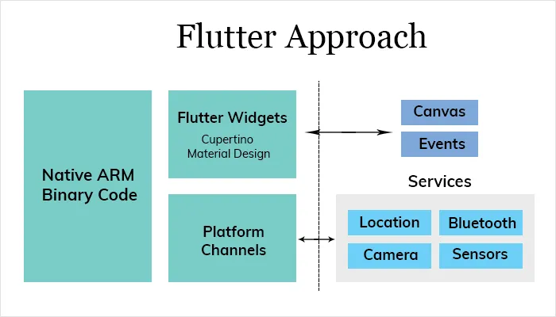

In this article I intend to show my perspective about this technology, and its ability to help tech companies in their fight for space in different markets.

>Flutter is an SDK created by Google and launched in 2017, facilitating the development of cross-platform applications.

**OK**, I understand that this description make much mobile developers in doubts when it comes to scalability and support, because with the product in the clients hands, we always want the better performance and fluidity. That is why we are going to unroll this doubts and understand what kind of problem this new technology solves.

---

## With great power…

Starting by the scalability ache, we always have an insecurity when it comes to put an IOS/Android App builded with a single source code in the hands of thousands clients and users, even with some big success cases, many times we feel that an native App has higher quality and fluidity in the usability.

And here comes the surprise, one of the most noticeable qualities in Flutter Apps is the fluidity, this ensures a **60fps rendering**, allied to an world of possibilities for [animations](https://flutter.dev/docs/development/ui/animations) and a versatility of componentization using the Widgets (I will write an article about widgets later, they are really important), really meets all kind of project regardless size. [Here are some cases](https://flutter.dev/showcase).

If you want to understand better how the rendering flux works, I recommend this [GoogleTechTalks video](https://www.youtube.com/watch?v=UUfXWzp0-DU). Below is a visual demo about how Flutter works:

One of the most interesting points to observe is the possibility to include native elements in a fast way, the **Platform Channels** are includes to Flutter architecture to provide this function.

---

## Run… but without tripping!

When I cited the market fight existing in everyday life of the technology companies, I wasn't kidding. Nowadays the timing to develop a new feature or deploy the fix of a bug in your App can cost much clients.

And here we can observe a new quality of Flutter described on [its site](https://flutter.dev/) (**Fast Development**).

Besides having a relativity short learning curve, mainly for developers that know Java, Swift, ObjectiveC, Javascript or others, the [Dart](https://dart.dev/) (Programming language used to develop Flutter projects) combined with a good folder structure and project organisation, can enable publishing of new apps or features with an expressive velocity, with quality of course.

## But where to start?

One of the most incredibles things that I saw when I start to develop in Flutter is the quantity of content made by Google, obviously the community was every day more expressive and also creating a lot of content all the time, but if there's something that I would indicate, beyond this [beautiful documentation](https://flutter.dev/docs), is the Udacity course, taught by the Flutter members themselves, and available for free. [Thats the Link](https://www.udacity.com/course/build-native-mobile-apps-with-flutter--ud905).

There are also people like [Pooja Bhaumik](https://poojabhaumik.medium.com/) who produce wonderful content.

---

### Lastly!

Let’s broaden the conversation, follow me on Twitter (@juniorlisboa29) and share with a friend that know Flutter, or not yet! :D
