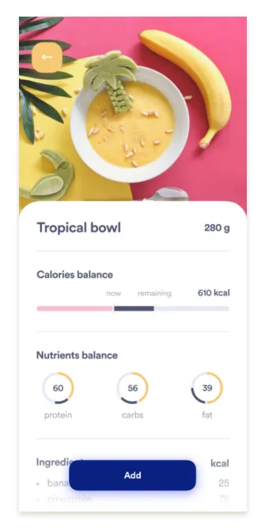
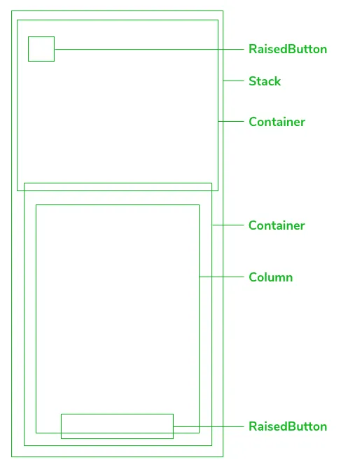
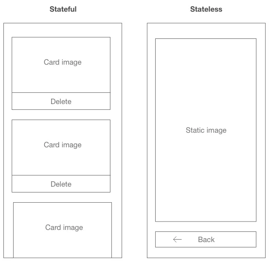
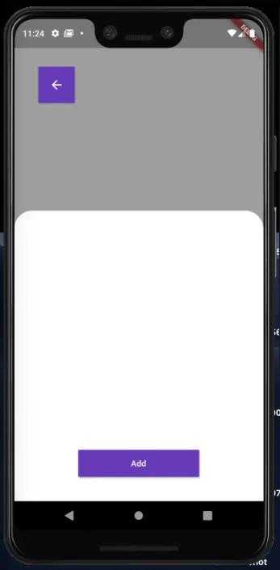

No Flutter os **Widgets** estão por todos os lados, fazendo uma rápida comparação com React, Vue e outras bibliotecas de Front-End baseadas em JavaScript, são componentes reutilizáveis de responsabilidade única, que facilitam o desenvolvimento de interfaces.

A primeira coisa que devemos analisar ao entender como uma interface será construída em Flutter é imaginar qual combinação de Widgets pode ser feita para chegar no resultado esperado, podemos desenvolver alguns customizados, utilizar os disponíveis do [catálogo do Flutter](https://flutter.dev/docs/development/ui/widgets) e até mesmo [pacotes](https://pub.dev/) criados pela comunidade.

Vamos abordar essas possibilidades, e entender os detalhes da utilização dos Widgets no desenvolvimento dos nossos Apps.

## Analisando layouts

É importante gastar um tempo pensando em como os Widgets podem se encaixar no contexto do layout para garantir uma implementação sólida.

Vamos analisar juntos um layout disponibilizado no [Dribble](https://dribbble.com/shots/8517134-Calorie-counter-concept) para entender a linha de raciocínio antes de colocar nossos conhecimentos em prática. A imagem abaixo representa uma tela conceito que iremos entender como pode ser implementada (Lembrando que sempre há mais de uma maneira para cada layout, tente ir pelo caminho mais simples).




A primeira coisa que notamos ao ver essa imagem são os componentes sobrepostos. O botão de baixo flutua sobre o conteúdo que por sua vez está acima de uma imagem, e no canto superior esquerdo existe um botão para a página anterior.

Com essas informações, podemos concluir que em nossa tela haverá um widget [Stack](https://api.flutter.dev/flutter/widgets/Stack-class.html) para criar a sobreposição, um bom exemplo de como escolher um Widget baseado em sua necessidade. Veja abaixo uma representação de como os items devem estar posicionados dentro da Stack:


Este Widget está presente no pacote do Material, que sempre precisa estar em seus arquivos de layout (Não se preocupe pois este é o principal pacote e já vem disponível). Você pode utilizar este e outros recursos do pacote incluindo o seguinte import no início do arquivo:

```dart
import ‘package:flutter/material.dart’;
```

Analisando cada um dos principais pontos do Layout, conseguimos ir decidindo quais widgets do catálogo podem ser utilizados. Veja abaixo um mapeamento simples com base nos elementos visuais:



Ao mapear as possibilidades de maneira mais abrangente, podemos então nos organizar com relação á estrutura da tela e entender em quantas partes podemos separar a implementação.

## Utilizando os items do catálogo

Agora que entendemos que existe uma gama de recursos diferentes para utilizarmos em nossos projetos ([Widgets do catálogo](https://flutter.dev/docs/development/ui/widgets), Widgets da comunidade ou nossos próprios Widgets), vamos colocar as mãos na massa e, de forma prática, ver a utilização desses recursos.

Para a instalação do Flutter, você pode seguir os respectivos passos [Neste Link](https://flutter.dev/docs/get-started/install), de acordo com o seu sistema operacional. Para a criação do projeto existe mais de uma maneira, porém irei utilizar o terminal.

Iremos criar um novo projeto, portanto, executar o seguinte comando no terminal:

```shell
$ flutter create widgets_dribble_page
```

Com o projeto inicial padrão em mãos, explorando o arquivo principal (localizado em lib/main.dart), já podemos entender os dois tipos de Widgets existentes no Flutter: o Stateless e o Stateful.

```dart
class MyHomePage extends StatefulWidget {
  MyHomePage({Key key, this.title}) : super(key: key);
  final String title;
  @override
  _MyHomePageState createState() => _MyHomePageState();
}

class _MyHomePageState extends State<MyHomePage> {
  int _counter = 0;

  void _incrementCounter() {
    setState(() {
      _counter++;
    });
  }

  @override
  Widget build(BuildContext context) {
    return Scaffold(
      appBar: AppBar(
        title: Text(widget.title),
      ),
      body: Center(
        child: Column(
          mainAxisAlignment: MainAxisAlignment.center,
          children: <Widget>[
            Text(
              'You have pushed the button this many times:',
            ),
            Text(
              '$_counter',
              style: Theme.of(context).textTheme.display1,
            ),
          ],
        ),
      ),
      floatingActionButton: FloatingActionButton(
        onPressed: _incrementCounter,
        tooltip: 'Increment',
        child: Icon(Icons.add),
      ),
    );
  }
}
```

Como o nome já diz, temos dois tipos de widgets para fins de controle de estado da nossa aplicação.



Ao lado esquerdo, uma tela baseada em um Widget stateful, pois ela irá atualizar quando um card for deletado, e isso afetará seu estado, fazendo com que exista uma nova renderização. Ao lado direito, a tela apenas exibe a imagem e permite a mudança de rota, para que o usuário retorne a tela anterior, sem alteração de estado alguma.

Os widgets Stateful estendem da classe `StatefulWidget`, respectivamente, os Stateless estendem a `StatelessWidget`.

Sabendo a diferença nos tipos, podemos compreender o motivo do Widget passado no parâmetro home ser Stateful: Ele possui um **setState**, para iterar a variável **_counter**.

Mas não iremos nos preocupar com isso para implementar esta tela, vamos simplificar nosso arquivo *main.dart*, criar um arquivo chamado *lib/screen.dart* e substituir o Widget **MyHomePage** pelo Widget **Screen** (que criamos para ser a base da nossa tela).

main.dart:

```dart
import 'package:flutter/material.dart';
import 'package:widgets_dribble_page/screen.dart';

void main() => runApp(MyApp());

class MyApp extends StatelessWidget {
  @override
  Widget build(BuildContext context) {
    return MaterialApp(
      title: 'Flutter Demo',
      theme: ThemeData(
        primarySwatch: Colors.blue,
      ),
      home: Screen(),
    );
  }
}
```

screen.dart:

```dart
import 'package:flutter/material.dart';

class Screen extends StatelessWidget {
	@override
	Widget build(BuildContext context) {
		return Container(
			color: Colors.amber,
		);
	}
}
```

Agora começaremos a utilizar os Widgets presentes no catálogo oficial, com base na análise do layout feita anteriormente. Não irei entrar no detalhe sobre cada um individualmente, porém podemos entender seu funcionamento como um todo.

## Nossos próprios Widgets

Agora, vamos montar essa estrutura criando parte a parte do nosso layout, e depois unir utilizando, como foi dito anteriormente, um **Stack**.

Vamos aos Widgets criados.

**_image()** — No momento não vamos importar nenhuma imagem de fato, mas esse Widget fará o papel do posicionamento da imagem.

```dart
Widget _image() {
    return Container(
        color: Colors.grey,
        height: 400,
    );
}
```

**_content()**


```dart
Widget _content() {
    return Container(
        height: 480,
        decoration: BoxDecoration(
            color: Colors.white,
            borderRadius: BorderRadius.only(
                topLeft: Radius.circular(30),
                topRight: Radius.circular(30),
            ),
        ),
    );
}
```
**_action()**


```dart
Widget _action() {
    return Container(
        width: 200,
        height: 45,
        margin: EdgeInsets.only(bottom: 40),
        child: RaisedButton(
            color: Colors.deepPurple,
            onPressed: () {},
            child: Text(
                'Add',
                style: TextStyle(
                    color: Colors.white
                ),
            ),
        ),
    );
}
```
E por fim, o botão do topo, que mesmo estando posicionado acima, será o último item da nossa Stack, pois no contexto da Stack, os últimos items estão sempre sobrepostos com relação aos anteriores.

**_backBtn()**

```dart
Widget _backBtn() {
    return Container(
        height: 60,
        width: 60,
        margin: EdgeInsets.only(
            left: 40,
            top: 80,
        ),
        child: RaisedButton(
            color: Colors.deepPurple,
            onPressed: () {},
            child: Icon(
                Icons.arrow_back,
                color: Colors.white,
            ),
        ),
    );
}
```

Ao utilizar uma Stack, precisamos também informar a localização onde nosso Widget se posicionará, e uma das maneiras de fazer isso, é utilizando o Widget **Align**, e informando um **alignment**. Assim concluímos o método **build** da nossa classe **Screen** (método padrão que sempre exporta o widget principal da classe), e temos o seguinte resultado:

```dart
@override
Widget build(BuildContext context) {
    return Scaffold(
        body: Stack(
            children: <Widget>[
                Align(
                    alignment: Alignment.topCenter,
                    child: _image(),
                ),
                Align(
                    alignment: Alignment.bottomCenter,
                    child: _content(),
                ),
                Align(
                    alignment: Alignment.bottomCenter,
                    child: _action(),
                ),
                Align(
                    alignment: Alignment.topLeft,
                    child: _backBtn(),
                ),
            ],
        ),
    );
}
```

E executando o projeto, podemos ver que a estrutura aplicada está de acordo como nosso planejamento:



Após criar a estrutura, você pode se atentar a detalhes como borda, cores e até mesmo pequenos ajustes de posicionamento.

### Conclusões
Ao analisar um layout com calma e entender melhor o catálogo de Widgets, podemos ter mais velocidade durante o desenvolvimento, e também garantir mais qualidade nos Apps desenvolvidos.

O projeto está disponível [Neste Link](https://github.com/junior2910/simple_widget_explanation) para que você possa continuar os estudos e incrementar nossa estrutura.

Nos vemos em breve!